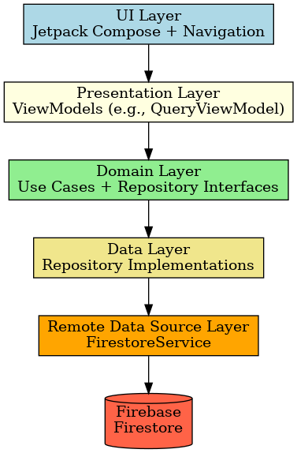
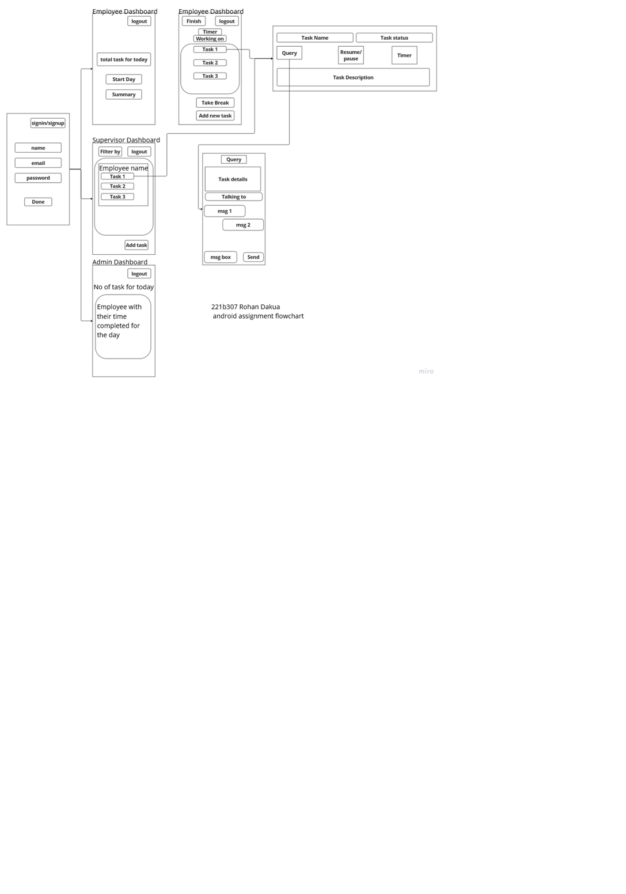

# PropVivo Task Management App 🗂️

This is a **Task and Attendance Management System** developed as part of an Android Developer Internship assessment. It allows employees to manage tasks, track progress, and take timed breaks, with data synced to Firebase.
## 📄 Demo(https://www.youtube.com/watch?v=F1H0_yY5eDA&feature=youtu.be)

---

## 📱 Features

### ✅ Task Management
- Assign and receive tasks.
- Timer starts when a task is in progress.
- Timer progress auto-saved to Firestore every 10 minutes.

### ⏳ Breaks
- Break feature with a 30-minute timer.
- Confirmation dialog before starting a break.

### 💬 Query Chat System
- Employees can raise queries related to tasks.
- Chat-based interface powered by Firestore.

---

## 🧱 Architecture

The app follows **Clean Architecture** and uses:
- **Jetpack Compose** for UI
- **MVVM** pattern
- **Repository** pattern
- **Hilt** for Dependency Injection

### Layers:
```
UI (Jetpack Compose)
   ↕
Presentation (ViewModels)
   ↕
Domain (Use Cases, Entities)
   ↕
Data (Firebase Repos)
```

---

## 🛠️ Tech Stack

- Kotlin
- Jetpack Compose
- Firebase Firestore 🔥
- Hilt for DI
- Coroutines & Flows
- Material 3
- Datastore

---

## 📷 Architecture Diagram




---

## 🚀 Getting Started

1. Clone the repo.
2. Set up Firebase and add your `google-services.json`.
3. Run the app in Android Studio.

---

## 🙋‍♂️ Author

Made with ❤️ by [Rohan Dakua](https://github.com/rohandakua)

---

## 📄 License

This project is licensed under the MIT License.
